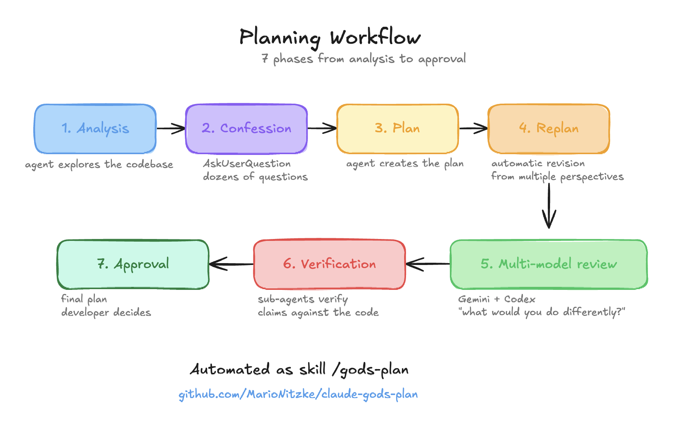

# God's Plan

[](https://github.com/MarioNitzke/claude-gods-plan)
[](LICENSE)

Multi-model planning plugin for Claude Code. One command, 8 phases, full audit trail.

## Installation

```bash
# God's Plan
claude plugin marketplace add MarioNitzke/claude-gods-plan
claude plugin install gods-plan@gods-plan

# Codex — required for external review
claude plugin marketplace add openai/codex-plugin-cc
claude plugin install codex@openai-codex

# Gemini — recommended, adds frontend/UX perspective (without it, all reviews go to Codex)
claude plugin marketplace add MarioNitzke/gemini-plugin-cc
claude plugin install gemini@MarioNitzke-gemini

# Serena — recommended for deeper code analysis (without it, falls back to Glob/Grep)
# Follow instructions at https://github.com/oraios/serena
```

## Usage

Works best in plan mode. Just one command:

```
/gods-plan Add a notification system for booking confirmations
```

You talk to Claude in three moments — brainstorming (Phase 0), requirements (Phase 2), and final approval (Phase 7). Everything else runs on its own.

## How it works



| Phase | What happens |
|-------|-------------|
| 0 — Brainstorming | Explore intent, propose 2-3 approaches, pick a direction |
| 1 — Analysis | Deep codebase dive via Serena or Glob/Grep (3 parallel subagents) |
| 2 — Confession | Claude asks 8+ specific questions about requirements |
| 3 — Draft | Bite-sized implementation plan written internally |
| 4 — Replan | 3-8 internal reviewers check from different angles |
| 5 — Friends | 3x Codex + 3x Gemini, each reviewing a targeted topic |
| 6 — Verification | Every external suggestion fact-checked against actual code |
| 7 — Presentation | Final plan with full audit trail — you approve or adjust |

In Phase 5, Claude picks 6 topics and splits them by model strengths — Codex gets backend (architecture, data, security), Gemini gets frontend (UI/UX, flows, accessibility). Each gets the full plan plus one focused question. All 6 run in parallel.

## Privacy

Phase 5 sends the plan and a project context summary to external models. No source code — only the plan text and conventions.

## License

MIT
